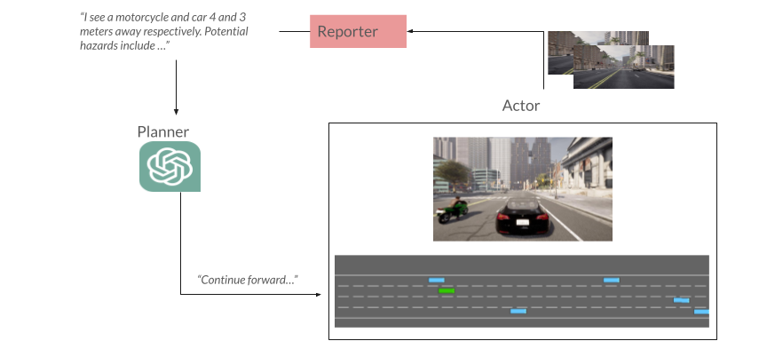
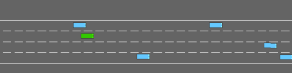
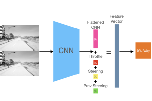

# 🚗 Collaborative Embodied Reasoning in Autonomous Driving

---

An extension of the Planner-Actor-Reporter framework applied to autonomous vehicles in Highway-Env and CARLA.



## Contents

- [Install](#install)
- [Planner](#planner)
- [Actor](#actor)
- [Reporter](#reporter)
- [Putting it all together](#planner-actor-reporter)
- [Results](#results)

## Install

If you only want to use Highway-env run the pip install commands:
```
pip install highway-env
pip install stable-baselines3[extra]
pip install openai
```

For CARLA, please follow the Nautilus GUI setup [guide](nautilus-files/README.md).

## Planner

 The planner is designed to take in prompts from the user and the environment inference from the reporter and produce an appropriate action for the actor, which is the reinforcement learning agent. We use pre-trained large language models as the planner. In this case, we have used GPT-3.5-turbo as our planner, utilizing the OpenAI's API. We have modeled the API output to only give the appropriate safe action for our vehicle.

### ChatGPT

We leverage OpenAI's API to use ChatGPT-3.5-Turbo. Below is a demo showcasing ChatGPT's planning skills when presented with a driving scenario from Highway-env.


## Actor

The Actor component of this framework adaptation serves two purposes: (i) give fine-control commands to the ego vehicle; and (ii) send images and actions to the reporter. The Actor for both Highway-Env and CARLA are trained using DRL algorithms. In future work, we hope to apply multi-goal reinforcement learning so that the Planner can issue more high-level commands for the Actor. 

### Highway-Env

For Highway-Env we train a DQN model that accepts commands from the Planner. We made custom Highway-Envs that challenged ChatGPT's reasoning skills.



### CARLA

In CARLA we present a simple DRL pipeline. Stacked gray-scaled images are passed into a CNN, concatenated with the ego vehicle's throttle, steering, and previous steering command. 
We train PPO and SAC.



## Reporter

The role of the reporter is to transform the Actor's observations and actions into a representation for the planner - in this case, text. 

### Hard-coded Reporter

The hard-coded reporter is a trivial ad-lib style report generator. It parses Highway-Env states for relevant information such as the ego vehicle's pose, speed, and other agent's positions. This information is formatted into a legible reporter for the Planner to decide the next move. 

See an example [here](reporter/hard-coded-reporter-highway-env.py)

### LLaVA  

Text-based state spaces are not always available. CARLA, for instance, offers RGB cameras, LiDAR, and semantic segmentation sensors. This motivated us to fine-tune a VQA model so that we can pass in an image and generate a report of the driving scene. We [LLaVA](https://github.com/haotian-liu/LLaVA) for this implementation. 

See the [data collector page](reporter/carla-data-collection/README.md) for more info on getting training data to fine-tune LLaVA.

As for compute, we got by with two GeFORCE RTX-3090 in the Nautilus cluster. We would recommend a GPU with more video memory. 

## Planner-Actor-Reporter

More instructions coming soon! For now, checkout our sample scripts that combines all components [here](par.py)

## Results

